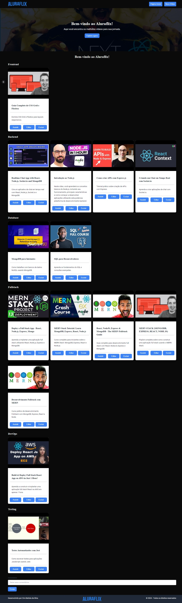

<h1 align="center"> 
Aluraflix (React-Next)
</h1>

<p align="center">
⚙️ Desenvolvimento de uma plataforma de vídeos educacionais da Alura, onde você pode encontrar os melhores vídeos para sua jornada de aprendizado. ⚙️
</p>

<br>

<p align="center">
  
</p>

<br>

## Funcionalidades

- Exibição de vídeos categorizados
- Adição de novos vídeos
- Edição de vídeos existentes
- Exclusão de vídeos
- Comentários sobre os vídeos

<br>

## 🛠 Tecnologias Utilizadas

Esse projeto foi desenvolvido com as seguintes tecnologias:

- [Next.js](https://nextjs.org/)
- [React](https://reactjs.org/)
- [Tailwind CSS](https://tailwindcss.com/)
- [Axios](https://axios-http.com/)
- [TypeScript](https://www.typescriptlang.org/)

<br>

## Instalação

1. Clone o repositório:

   ```bash
   git clone https://github.com/seu-usuario/aluraflix.git
   ```

2. Navegue até o diretório do projeto:

   ```bash
   cd aluraflix
   ```

3. Instale as dependências:

   ```bash
   npm install
   ```

4. Inicie o servidor de desenvolvimento:

   ```bash
   npm run dev
   ```

5. Abra o navegador e acesse `http://localhost:3000`.

<br>

## Estrutura do Projeto

- `src/components`: Componentes reutilizáveis da aplicação.
- `src/pages`: Páginas da aplicação.
- `src/app`: Configurações globais e layout da aplicação.
- `public`: Arquivos estáticos, como imagens e ícones.

<br>

## 📝 License

<p align="center">
  
</p>
<p align="center">Esse projeto está sob a licença MIT.</p>

<br>

### 👨‍💻 Autor

 
 <em>Ciro Batista da Silva<em>
 
 <br/>

 <p>👋🏽 Entre em contato!</p>

[](https://twitter.com/CiroSilva2020) [](https://www.linkedin.com/in/ciro-batista-da-silva-8b6838205/)
[](mailto:cirofight@gmail.com)
